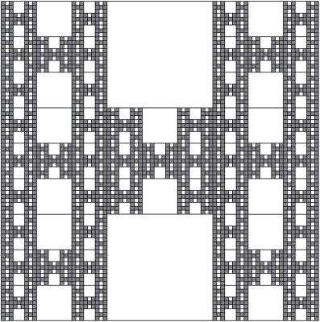

```{r setup, include = FALSE}
library(bookdown)
graphics.off()
solution <- FALSE
results <- FALSE
multi <- FALSE
knitr::opts_chunk$set(echo=solution,include=results)
knitr::opts_knit$set(global.device=FALSE)
knitr::opts_chunk$set(fig.pos="H",out.extra="")
set.seed(4)
# to render, run parsextra.R
```

\newif\ifsol\sol`r ifelse(solution, 'true', 'false')`
\newif\ifmulti\multi`r ifelse(multi, 'true', 'false')`
\ifmulti\pagestyle{empty}\fi

Unlike the exercises in the notes, whose solutions are provided in
Chapter 19, you must attempt these questions yourself before I will
share my answer with you. Please don't hesitate to ask questions. Then
upload your solution to
[`http://doubleblind.dynu.net/GEOL0061`](http://doubleblind.dynu.net/GEOL0061)
to download the model answer. Submissions won't be formally assessed,
so there is no need to worry if your answer is wrong. Try, struggle,
ask questions, and learn!

\ifmulti\clearpage\fi
# Random walk \label{sec:randomwalk}

Write an `R` function that simulates a random walk:

1. From a starting position of $x=0$ and $y=0$, move a virtual
particle by a distance of 1 in a random
direction. \label{it:randomwalk1}

   ```{r}
   xy <- c(0,0) # initial position
   d <- runif(1,min=0,max=2*pi) # choose a random direction
   dx <- cos(d)
   dy <- sin(d)
   xy[1] <- xy[1] + dx # updated x-position
   xy[2] <- xy[2] + dy # updated y-position
   ```

2. Repeat $n=1000$ times and plot the track of the particle as a
line. \label{it:randomwalk2}

   ```{r out.width="50%", out.height="50%", fig.width=5, fig.height=5}
   # random walk for one particle:
   walk <- function(xy0=rep(0,2),n=1000){
      xy <- matrix(rep(xy0,n),ncol=2,byrow=TRUE)
      d <- runif(n,min=0,max=2*pi)
      for (i in 2:n){
         dx <- cos(d[i])
         dy <- sin(d[i])
         xy[i,1] <- xy[i-1,1] + dx
         xy[i,2] <- xy[i-1,2] + dy
      }
      return(xy)
   }
   xy <- walk()
   plot(xy,type='l',xlab='x',ylab='y')
   ```

3. Repeat steps \ref{it:randomwalk1} and \ref{it:randomwalk2} for $N=500$
virtual particles and visualise their final positions on a scatter
plot. \label{it:randomwalk3}

   ```{r out.width="50%", out.height="50%", fig.width=5, fig.height=5}
   n <- 1000
   N <- 500
   xyf <- matrix(NA,nrow=N,ncol=2)
   for (i in 1:N){
      xyf[i,] <- walk(n=n)[n,]
   }
   plot(xyf,type='p',pch=16,xlab='x',ylab='y')
   ```

   \ifsol{\itshape
   The distribution of the end positions is dense in the middle and thins out
   near the edges. We will see (in Chapter 7 of the notes) that it follows
   a so-called bivariate Gaussian distribution.
   }\fi

\ifmulti\clearpage\fi
# Diffusion \label{sec:diffusion}

Using the code from exercise \ref{sec:randomwalk}:

1. Repeat step \ref{sec:randomwalk}.\ref{it:randomwalk3} for $n=250$, 500,
1000 and 2000 iterations and visualise the final positions on a
${2}\times{2}$ panel grid of scatter plots. Adjust the axis limits so
that all four panels are plotted at the same scale. \label{it:diffusion1}

   ```{r diffusion, out.width="50%", out.height="50%", fig.width=5, fig.height=5}
   cloud <- function(n=1000,N=500,plot=TRUE,...){
      xyf <- matrix(NA,nrow=N,ncol=2)
      for (i in 1:N){
         xyf[i,] <- walk(n=n)[n,]
      }
      if (plot) plot(xyf,pch=16,xlab='x',ylab='y',...)
      invisible(xyf) # returns the values without printing them at the console
   }

   par(mfrow=c(2,2),mar=rep(2,4))
   lims <- c(-100,100)
   ns <- c(250,500,1000,2000)
   for (n in ns){
      cloud(n=n,xlim=lims,ylim=lims)
      legend('topright',legend=paste('n=',n),bty='n')
   }
   ```

2. Plot the marginal distributions of the $x$-values as kernel density
estimates and empirical cumulative distribution functions.
\label{it:diffusion2}

   ```{r marginals, out.width="50%", out.height="50%", fig.width=5, fig.height=5}
   par(mfrow=c(2,2),mar=rep(2,4))
   for (n in ns){
      xy <- cloud(n=n,plot=FALSE)
      d <- density(xy[,1],from=-100,to=100)
      plot(d,main='')
      rug(xy[,1])
      legend('topleft',legend=paste('n=',n),bty='n')
   }
   for (n in ns){
      xy <- cloud(n=n,plot=FALSE)
      d <- ecdf(xy[,1])
      plot(d,xlim=c(-100,100),main='',verticals=TRUE,pch=NA)
      legend('topleft',legend=paste('n=',n),bty='n')
   }
   ```

3. Visualise the bivariate datasets as 2-dimensional
KDEs. \label{it:diffusion3}

   ```{r kde2d, out.width="50%", out.height="50%", fig.width=5, fig.height=5}
   par(mfrow=c(2,2),mar=rep(2,4))
   lims <- c(-100,100)
   for (n in ns){
      xy <- cloud(n=n,plot=FALSE)
      d2d <- MASS::kde2d(x=xy[,1],y=xy[,2],lims=rep(lims,2))
      contour(d2d,xlim=lims,ylim=lims)
      legend('topleft',legend=paste('n=',n),bty='n')
   }
   ```

   \ifsol{\itshape
   This exercise has shown how random walks of particles give rise to
   Gaussian diffusion, which produces characteristic `bell shaped'
   probability distributions (in one and two dimensions)
   that spread out over time.}\fi

\ifmulti\clearpage\fi
# Summary statistics \label{sec:summary-statistics}

Considering the dataset of counts whose ECDF is shown in the following
Figure:

   ```{r out.height="27.5%", fig.width=10, fig.height=5, include=TRUE, echo=FALSE}
   dat <- c(-20,-15,-12,-8,-5,0,6,7,9,9,10,10,10,11,13,15,20,40)
   plot(ecdf(dat),verticals=TRUE,pch=NA,xaxt='n',yaxt='n',main=NA)
   rug(dat,col='blue')
   axis(side=1,at=seq(from=-25,to=45,by=5))
   axis(side=2,at=c(0,0.25,0.5,0.75,1))
   ```

1. How many measurements are there in this dataset?

   \ifsol{\itshape
   There are 15 ticks in the rug plot. However, this includes some
   duplicate values. A better way to count the observation is to use
   the steps in the ECDF. There are 13 single steps, one double step (at 9),
   and one triple step (at 10). Thus, the dataset contains 18 values.
   }\fi

2. What are their median and IQR?

   \ifsol{\itshape
   Drawing the 25, 50 and 75 percentiles as dashed lines on the ECDF:
   }\fi

   ```{r out.height="27.5%", fig.width=10, fig.height=5, include=TRUE, echo=FALSE}
   plot(ecdf(dat),verticals=TRUE,pch=NA,xaxt='n',yaxt='n',main=NA)
   rug(dat,col='blue')
   axis(side=1,at=seq(from=-25,to=45,by=5))
   axis(side=2,at=c(0,0.25,0.5,0.75,1))
   p <- par('usr')
   med <- median(dat)
   lines(c(p[1],med),rep(0.5,2),lty=2,col='red')
   lines(rep(med,2),c(0,0.5),lty=2,col='red')
   lq <- quantile(dat,0.25,type=1)
   lines(c(p[1],lq),rep(0.25,2),lty=2,col='red')
   lines(rep(lq,2),c(0,0.25),lty=2,col='red')
   uq <- quantile(dat,0.75,type=1)
   lines(c(p[1],uq),rep(0.75,2),lty=2,col='red')
   lines(rep(uq,2),c(0,0.75),lty=2,col='red')
   ```
   \ifsol{\itshape
   The 25, 50 and 75 percentiles are -5, 9 and 11, respectively.
   Therefore, the median is 9 and the IQR is $11-(-5)=16$.
   }\fi

3. Draw a box plot for this dataset (either using `R`, or by hand with
pencil on paper).  Does it identify any outliers?

   \ifsol{\itshape
   By hand, you would first draw a box from $-5$ to 10, with a line at 9.
   Then, whiskers would extend from this box until $-20$ and $+20$. The
   value of 40 is an outlier, because $40-11=29>1.5\times$IQR$=24$.

   Using \texttt{R}:
   }\fi
   ```{r out.width="50%"}
   dat <- c(-20,-15,-12,-8,-5,0,6,7,9,9,10,10,10,11,13,15,20,40)
   boxplot(dat,horizontal=TRUE)
   ```

\ifmulti\clearpage\fi
# Probability \label{sec:probability}

1. A deck of 52 cards is shuffled thoroughly. What is the probability
that the four aces are all next to each other?

   \ifsol{\itshape
   There are 52! ways to shuffle a deck of cards. There are 4! ways to
   arrange a sequence of four aces, and 48! ways to arrange the remaining
   cards. Finally, there are 49 ways to insert the group of four aces
   in between the 48 remaining cards. Therefore, the probability
   of the four aces sitting next to each other is:
   \[
   \frac{4!48!49}{52!} =
   \frac{4\cdot{3}\cdot{2}}{52\cdot{51}\cdot{50}} =
   \frac{1}{5525}
   \]
   }\fi

2. Suppose that a password needs to contain exactly 8 characters and
must include at least one lowercase letter, uppercase letter and
digit. How many such passwords are possible?

   \ifsol{\itshape Let $|x|$ stand for `the number of outcomes for $x$'. Then
   \[
   |\mbox{good passwords}| = |\mbox{all passwords}| - |\mbox{bad passwords}|
   \]
   where
   \[
   |\mbox{all passwords}| = (26+26+10)^8
   \]

   The number of bad passwords requires the \emph{inclusion-exclusion
   principle}, which is similar to the additive rule of probability
   (Equation 4.4 of the notes). Let $u$, $l$ and $d$ represent outcomes
   \textbf{lacking} uppercase letters, lowercase letters and digits,
   respectively. Then we are looking for all possible combinations of
   those three outcomes:
   \[
   |\mbox{bad passwords}| = \left| u \cup l \cup d \right|
   \]
   \[
   = \left| u \cup l \right| + \left| d \right| - \left| u \cup l \cap d \right|
   \]
   \[
   = \left| u \right| + \left| l \right| + \left| d \right|
   - \left| u \cap l \right| - \left| \left(u \cup l\right) \cap d \right|
   \]
   \[
   = \left| u \right| + \left| l \right| + \left| d \right|
   - \left| u \cap l \right| - \left| u \cap d \right| - \left| l \cap d \right|
   + \left| u \cap l \cap d \right|
   \]
   where $\left| u \cap l \cap d \right| = 0$ so that
   \[
   |\mbox{good passwords}| = (26+26+10)^8 - (26+26)^8 -
   (26+10)^8 - (26+10)^8 + 26^8 + 26^8 + 10^8
   \]

   In \texttt{R}:
   }\fi

   ```{r prob1}
   len <- 8 # length of the password
   nupper <- 26 # A -> Z
   nlower <- 26 # a -> z
   ndigit <- 10 # 0 -> 9
   # total number of 8-character strings:
   N <- (nupper+nlower+ndigit)^len
   # remove all the passwords with no uppercase letter, lowercase letter, or digit:
   N <- N - (nlower+ndigit)^len - (nupper+ndigit)^len - (nlower+nupper)^len
   # But then you removed some passwords twice. You must add back
   # all passwords with no lowercase AND no uppercase, 
   # no lowercase AND no digit, or no uppercase AND no digit:
   N <- N + ndigit^len + nupper^len + nlower^len
   # hence the total number of passwords is
   print(N)
   ```

\ifmulti\clearpage\fi
# Bernoulli variables \label{sec:Bernoulli}

1. The following table shows the cumulative distribution function of a
discrete random variable. 

   \begin{tabular}{l|llllll}
   $x$    & 0 & 1 & 2 & 3 & 4 & 5 \\ \hline
   $F(x)$ & 0 & .1 & .3 & .7 & .8 & 1.0
   \end{tabular}

   Find the probability mass function. What is the mode?

   \ifsol{\itshape
   Taking the differences of the cumulative probabilities:
   
   \begin{tabular}{l|llllll}
   $x$                 & 0  & 1  & 2  & 3  & 4  & 5 \\ \hline
   $F(x)$              & 0  & .1 & .3 & .7 & .8 & 1.0 \\
   $F(x_i)-F(x_{i-1})$ & -- & .1 & .2 & .4 & .1 & .2
   \end{tabular}

   Plotting as a bar chart:
   }\fi

   ```{r echo=FALSE, out.width="40%"}
   pmf <- diff(c(0,.1,.3,.7,.8,1.0))
   names(pmf) <- 1:5
   barplot(pmf)
   ```

   \ifsol{\itshape
   The mode is 3.
   }\fi

2. Which is more likely: 9 heads in 10 tosses of a fair coin, or 18
heads in 20 tosses?

   \ifsol{\itshape
   \[\binom{10}{9}0.5^{10} = 0.0098\]

   \[\binom{20}{18}0.5^{20} = 0.00018\]

   Conclusion: 9 heads out of 10 tosses is more likely than 18 heads out
   of 20 tosses.
   }\fi

3. Suppose that in a sequence of independent Bernoulli trials each
with probability of success $p$, the number of failures ($k$) up to
the first success is counted. What is the probability mass function of
this random variable? Suppose that $p=0.25$. What is the probability
that $k=5$?

   \ifsol{\itshape
   The probability of failure is $(1-p)$. The probability of $k$ failures
   is $(1-p)^k$. Therefore, the probability of $k$ failures followed by
   1 success is
   \[P(X=k) = (1-p)^k p\]
   Hence
   \[P(X=5) = (1-0.25)^5 0.25 = 0.059\]
   }\fi

4. Continuing with the previous question, what is the probability mass
function for the number of failures up to the $r$^th^ success?

   \ifsol{\itshape
   The probability of a specific outcome of $k$ failures and $r$ successes:
   \[
   (1-p)^k p^r
   \]
   The number of ways to shuffle these outcomes is $\binom{k+r}{k}$. However,
   the last outcome must be a success and cannot be shuffled. Therefore, the
   number of shuffled outcomes is $\binom{k+r-1}{k}$, and the
   probability of $k$ failures up to the $r$\textsuperscript{th} success is
   \[\binom{k+r-1}{k}(1-p)^k p^{r-1} p = \binom{k+r-1}{k}(1-p)^k p^r\]
   This is the PMF of the so-called negative binomial distribution
   (see Equation 7.1 of the notes).
   }\fi

\ifmulti\clearpage\fi
# (binomial) hypothesis tests \label{sec:binomialtest}

A coin is thrown independently 10 times to test the hypothesis that
the probability of heads is 0.5 versus the alternative that the
probability is not 0.5.

1. What is the minimum significance level $\alpha$ that would reject
outcomes of either 0 or 10 heads?

   \ifsol{\itshape
   The fact that the rejection region consists of 0 and 10 implies that
   \[\binom{10}{0} 0.5^{10} = \binom{10}{10} 0.5^{10} = \alpha/2\]
   Therefore
   \[\alpha = 2 \times 0.5^{10} = 0.002\]
   Note that $\alpha$-values greater than this but smaller than
   \[\sum_{i\in\{0,1,9,10\}}{10\choose i}0.5^{10} = 0.021\]
   would have the same rejection region.
   }\fi

2. Using the rejection region from the previous exercise, what is the
power of the test if the probability of heads is in fact not 0.5 but
0.1?

   \ifsol{\itshape
   The power is defined as $1 - \beta$, where $\beta$ is the probability of
   rejecting a true null hypothesis. In other words, the power of the test
   is the probability of rejecting a false null hypothesis. Since our rejection
   region consists of the outcomes 0 and 10, this probability is
   \[
   \mbox{power} = \binom{10}{0}0.9^{10} + \binom{10}{10}0.1^{10} = 0.35
   \]
   }\fi

3. Suppose that the coin is thrown 20 times, with again a 0.1 true
probability of heads. Using the significance level from step 1, what
is the power of a two-sided test with $H_0: p=0.5$? Use `R` to answer
this question.

     ```{r}
     alpha <- 2*0.5^10
     n <- 20
     p0 <- 0.5
     pa <- 0.1
     k <- qbinom(alpha/2,size=n,prob=p0)
     message('rejection region = {0,...,',k-1,',',n-k+1,',...,',n,'}')
     power <- pbinom(k-1,size=n,prob=pa) + pbinom(n-k,size=n,prob=pa,lower.tail=FALSE)
     message('power = ',signif(power,2))
     ```
     
\ifmulti\clearpage\fi
# Confidence intervals \label{sec:binomialci}

1. Consider a Bernoulli experiment with $k=16$ successes out of
$n=40$ trials.  Use \texttt{R}'s \texttt{binom.test()} function to
construct a 95\% confidence interval for the parameter $p$. Compare
your result with the approximate Equations 5.8 and 5.9 of the notes.

   ```{r}
   k <- 16
   n <- 40
   ci1 <- binom.test(x=k,n=n)$conf.int
   message('exact C.I:[',paste(signif(ci1,3),collapse=','),']')
   phat <- k/n
   sphat <- sqrt(phat*(1-phat)/n)
   ci2 <- phat + c(-1,1)*1.96*sphat
   message('approximate C.I:[',paste(signif(ci2,3),collapse=','),']')
   ```

2. Repeat the previous experiment for $k=4$ and $n=10$, and then again
for $k=40$ and $n=100$, and for $k=1$ and $n=40$. How does the
accuracy of the approximation change as a function of sample size and
the value of the parameter $p$?

   ```{r}
   conftest <- function(n,k){
      ci1 <- binom.test(x=k,n=n)$conf.int
      message('exact C.I:[',paste(signif(ci1,3),collapse=','),']')
      phat <- k/n
      sphat <- sqrt(phat*(1-phat)/n)
      ci2 <- phat + c(-1,1)*1.96*sphat
      message('approximate C.I:[',paste(signif(ci2,3),collapse=','),']')
   }
   conftest(n=10,k=4)
   conftest(n=100,k=40)
   conftest(n=40,k=1)
   ```

   \ifsol{\itshape
   Conclusion: the accuracy of the approximation is excellent for $n=100$,
   and poor for $n=10$. It is best not to use the approximation for $n<20$.
   The accuracy also suffers when $\hat{p}=n/k$ is
   close to 0 (or 1). In the case of $k=1$ and $n=40$,
   the approximate confidence interval spills over into nonsensical
   negative values.
   }\fi

3. How large a sample do you need to reduce the width of a 95\%
confidence interval for $p$ to 0.01 when $k/n=0.5$?

   \ifsol{\itshape
   The width of the approximate 95\% confidence interval is 
   \[
   (\hat{p} + 1.96 s[\hat{p}]) - (\hat{p} - 1.96 s[\hat{p}]) =
   2 \times 1.96 s[\hat{p}] = 3.92 \sqrt{\frac{\hat{p}(1-\hat{p})}{n}} = 0.01
   \]
   Therefore
   \[
   n = \hat{p}(1-\hat{p}) 392^2 = 0.5^2 392^2 = 38416
   \]
   }\fi

\ifmulti\clearpage\fi
# The Poisson distribution \label{sec:Poisson}

1. Telephone calls are received at a certain residence as a Poisson process
with parameter $\lambda=2$ per hour.

   (a) If Diane takes a 10-min. shower, what is the probability that the
   phone rings during that time?
      \ifsol{\itshape
      Let $\lambda'$ be the expected number of phone calls per 10-min. period.
      Then $\lambda'=\lambda\times{10/60}=2/6=1/3$.
      Hence,the probability that the phone rings during the shower is
      \[
      P(k>0|\lambda'=1/3) = 1 - P(k=0|\lambda'=1/3) =
      1-\frac{\lambda'^ke^{-\lambda'}}{k!} = 1-e^{-1/3} = 0.28
      \]
      Conclusion: there is a 28\% chance that Diane's shower is interrupted.
      }\fi

   (b) How long can her shower be if she wishes the probability of
   interruptions to be at most 0.5?
      \ifsol{\itshape
      \[
      P(k>0|\lambda'\equiv\lambda{t/60}) = 1 - P(k=0|\lambda') =
      1-\frac{\lambda'^ke^{-\lambda'}}{k!} < 0.5
      \]
      \[
      \Rightarrow 1-\exp(-\lambda') < 0.5 \Rightarrow
      \lambda{t/60} > -\ln(0.5) = 0.069
       \Rightarrow t > \frac{0.069\times{60}}{2} = 20.8
      \]
      Answer: Diane's shower can last at most 20.8 minutes.
      }\fi

2. Recoil track geochronology is an novel dating technique that
is based on the following equation:
   \[t = \frac{1}{\lambda_{238}}\ln\left(\frac{N}{U}+1\right)\]

   where $t$ is the age, $\lambda_{238}$ is the decay constant of
   \textsuperscript{238}U (=0.000155125 Myr$^{-1}$, which is not to be
   confused with the Poisson parameter $\lambda$!), $U$ is the
   \textsuperscript{238}U-concentration (in atoms/\textmu{m}$^{-3}$),
   and $N$ is the volume density of the recoil tracks (in
   \textmu{m}$^{-3}$). $N$ follows a Poisson distribution with unknown
   parameter. Suppose that $n=100$ and $U=10^5$. Could the sample be
   less than 8 million years old?

   \ifsol{\itshape
   Rearranging the age equation for $N$:
   \[N = U\left(\exp[\lambda_{238}t]-1\right)\]
  
   Plugging the measurements into this rearranged equation:
   \[\hat{N} = 10^5\left(e^{{0.000155125}\times{8}}-1\right) = 124.177 \]
  
   where $\hat{N}$ stands for the `expected value' of $N$.
   To test whether this is compatible with the observed outcome
   of $N=100$, we formulate the following null hypothesis:
   \[H_0: \lambda = \hat{N} = 124.177\]

   versus the alternative hypothesis:
   \[H_a: \lambda < 124.177\]

   Using \texttt{R}:
   }\fi
   ```{r}
   age <- 8
   N <- 100
   U <- 1e5
   L38 <- 0.000155125
   Nhat <- U*(exp(L38*age)-1)
   pval <- ppois(N,lambda=Nhat)
   message(ifelse(pval<0.05,'H0 is rejected','H0 is not rejected'))
   ```

\ifmulti\clearpage\fi
# Continuous variables and normal distributions \label{sec:normal}

The following three questions require some simple calculus, and are based
on the relationship that the probability density $f$ and the cumulative
distribution function $F$ are related as follows:
\[f(x) = \frac{\partial{F(x)}}{\partial{x}}\]

1. What is the probability density for the distance from an event to
its nearest neighbour for a Poisson process in the plane?

   \ifsol{\itshape   
   Let $\lambda$ be the Poisson parameter that controls the average 
   number of events per unit area:
   \[
   P(k|\lambda) = \frac{\lambda^ke^{-\lambda}}{k!}
   \]
   The Poisson process produces a random collection of points.
   Suppose that we take any location (the origin, say) and look
   for the closest point from our collection. Let the distance
   to this point be $X$. Then the probability that this distance
   falls inside a circle of radius $r$ is given by
   \[
   F(X\leq{r}) = 1 - P(X>r) = 1-\exp[-\lambda\pi{r}^2]
   \]
   By definition, the probability density is given by
   \[
   f(r) = \frac{\partial{F(X\leq{r})}}{\partial{r}} =
   2\lambda\pi{r}\exp[-\lambda\pi{r}^2]
   \]
   }\fi

2. If $x$ follows a normal distribution with mean $\mu$
and standard deviation $\mu$, and $y = a + bx$, prove that
$y$ follows a normal distribution with mean $a + b\mu$ and standard
deviation $b\sigma$

   \ifsol{\itshape
   It is easy to show that
   \[
   x[y] = \frac{y-a}{b}
   \]
   The cumulative distribution of $x$ is
   \[
   F(x) = \int\limits_{-\infty}^{x}
   \frac{1}{\sigma\sqrt{2\pi}}
   \exp\left[\frac{(x-\mu)^2}{2\sigma^2}\right]
   \]
   Therefore
   \[
   f(y) = \frac{\partial{F(x[y])}}{\partial{y}}
   = \frac{\partial{F(x)}}{\partial{x}}\frac{\partial{x}}{\partial{y}}
   = \frac{f(x)}{b} = \frac{1}{\sigma\sqrt{2\pi}}
   \exp\left[\frac{(x[y]-\mu)^2}{2\sigma^2}\right]
   \frac{1}{b}
   \]
   \[
   = \frac{b}{b\sigma\sqrt{2\pi}}
   \exp\left[\frac{(y-a-b\mu)^2}{2(b\sigma)^2}\right]\frac{1}{b}
   = \frac{1}{b\sigma\sqrt{2\pi}}
   \exp\left[\frac{(y-[a-b\mu])^2}{2(b\sigma)^2}\right]
   = \frac{1}{\sigma'\sqrt{2\pi}}
   \exp\left[\frac{(y-\mu')^2}{2\sigma'^2}\right]
   \]
   where $\mu' = a+b\mu$ and $\sigma'=b\sigma$, which proves the proposition.
   }\fi

3. Suppose that a particle of initial size $y_0$ is subjected to
repeated impacts, that on each impact a proportion $X_i$ of the
particle remains, and that $X_i$ can be modelled as independent random
variables having the same distribution (for $1\leq{i}\leq{n}$,
say). Prove that the logarithm of the resulting particle sizes follows
a normal distribution.

   \ifsol{\itshape
   After $n$ impacts, the particle size has been reduced to:
   \[y_n = X_nX_{n-1}\ldots{X_2}{X_1}y_0\]
   Taking logarithms:
   \[\ln[y_n] = \ln[y_0] + \sum\limits_{i=1}^{n}\ln[X_i]\]
   which, thanks to the Central Limit Theorem, results in a normal
   distribution regardless of the distribution of $X_i$. $y_n$ is
   said to follow a \textbf{lognormal} distribution.
   }\fi

\ifmulti\clearpage\fi
# Error propagation

Equation 8.9 of the notes can be generalised from 1 to 2 dimensions:
\[
\left[
\begin{array}{@{}cc@{}}
s[u]^2 & s[u,v]\\
s[u,v] & s[v]^2
\end{array}
\right]
\approx
\left[
\begin{array}{@{}cc@{}}
\frac{\partial u}{\partial x} & \frac{\partial u}{\partial y} \\
\frac{\partial v}{\partial x} & \frac{\partial v}{\partial y}
\end{array}
\right]
\left[
\begin{array}{@{}cc@{}}
s[x]^2 & s[x,y]\\
s[x,y] & s[y]^2
\end{array}
\right]
\left[
\begin{array}{@{}cc@{}}
\frac{\partial u}{\partial x} & \frac{\partial v}{\partial x} \\
\frac{\partial u}{\partial y} & \frac{\partial v}{\partial y}
\end{array}
\right]
\]

Use this equation to answer the following questions:

1. If $x$ and $y$ are independent random variables with equal
variances, find $s[x+y,x-y]$.

   \ifsol{\itshape
   Let $u=x+y$ and $v=x-y$, and let $s^2$ be the variance of both $x$ and $y$.
   Then:
   \[
   \left[
   \begin{array}{@{}cc@{}}
   s[u]^2 & s[u,v]\\
   s[u,v] & s[v]^2
   \end{array}
   \right]
   \approx
   \left[
   \begin{array}{@{}cc@{}}
   1 & 1 \\
   1 & -1
   \end{array}
   \right]
   \left[
   \begin{array}{@{}cc@{}}
   s^2 & 0\\
   0 & s^2
   \end{array}
   \right]
   \left[
   \begin{array}{@{}cc@{}}
   1 & 1 \\
   1 & -1
   \end{array}
   \right]
   =
   \left[
   \begin{array}{@{}cc@{}}
   2s^2 & 0 \\
   0 & 2s^2
   \end{array}
   \right]
   \]
   Hence, $s[u,v]=s[x+y,x-y]=0$.
   }\fi

2. If $u=a+bx$ and $v=c+dy$, show that $|r[x,y]| = |r[u,v]|$.

   \ifsol{\itshape
   Let us first calculate $s[u,v]$:
   \[
   \left[
   \begin{array}{@{}cc@{}}
   s[u]^2 & s[u,v]\\
   s[u,v] & s[v]^2
   \end{array}
   \right]
   \approx
   \left[
   \begin{array}{@{}cc@{}}
   b & 0 \\
   0 & d
   \end{array}
   \right]
   \left[
   \begin{array}{@{}cc@{}}
   s[x]^2 & s[x,y]\\
   s[x,y] & s[y]^2
   \end{array}
   \right]
   \left[
   \begin{array}{@{}cc@{}}
   b & 0 \\
   0 & d
   \end{array}
   \right]
   =
   \left[
   \begin{array}{@{}cc@{}}
   b^2s[x]^2 & bds[x,y] \\
   bds[x,y] & d^2s[y]^2
   \end{array}
   \right]   
   \]
   Therefore:
   \[
   \left|r[u,v]\right| =
   \left|\frac{s[u,v]}{s[u]s[v]}\right| =
   \left|\frac{bds[x,y]}{bs[x]ds[y]}\right| =
   \left|\frac{s[x,y]}{s[x]s[y]}\right| =
   \left|r[x,y]\right|
   \]
   which proves the proposition.
   }\fi

3. If $x$ and $y$ are independent random variables and $z=y-x$, find
expressions for the covariance and the correlation of $x$ and $z$ in
terms of the variances of $x$ and $y$. [Hint: generalise the error
propagation from 2 to 3 dimensions].

   \ifsol{\itshape
   Writing out the error propagation in 3-dimensions:
   \[
   \left[
   \begin{array}{@{}ccc@{}}
   s[x]^2 & s[x,y] & s[x,z]\\
   s[x,y] & s[y]^2 & s[y,z]\\
   s[x,z] & s[y,z] & s[z]^2\\
   \end{array}
   \right]
   \approx
   \left[
   \begin{array}{@{}cc@{}}
   \frac{\partial x}{\partial x} & \frac{\partial x}{\partial y} \\
   \frac{\partial y}{\partial x} & \frac{\partial y}{\partial y} \\
   \frac{\partial z}{\partial x} & \frac{\partial z}{\partial y} \\
   \end{array}
   \right]
   \left[
   \begin{array}{@{}cc@{}}
   s[x]^2 & s[x,y]\\
   s[x,y] & s[y]^2
   \end{array}
   \right]
   \left[
   \begin{array}{@{}ccc@{}}
   \frac{\partial x}{\partial x} & \frac{\partial y}{\partial x} & \frac{\partial z}{\partial x} \\
   \frac{\partial x}{\partial y} & \frac{\partial y}{\partial y} & \frac{\partial z}{\partial y}
   \end{array}
   \right]
   \]
   Applying this formula to $z=y-x$:
   \[
   \left[
   \begin{array}{@{}ccc@{}}
   s[x]^2 & s[x,y] & s[x,z]\\
   s[x,y] & s[y]^2 & s[y,z]\\
   s[x,z] & s[y,z] & s[z]^2
   \end{array}
   \right]
   \approx
   \left[
   \begin{array}{@{}cc@{}}
   1 & 0 \\
   0 & 1 \\
   1 & -1
   \end{array}
   \right]
   \left[
   \begin{array}{@{}cc@{}}
   s[x]^2 & 0\\
   0 & s[y]^2
   \end{array}
   \right]
   \left[
   \begin{array}{@{}ccc@{}}
   1 & 0 & 1 \\
   0 & 1 & -1
   \end{array}
   \right]
   \]
   Hence:
   \[
   \left[
   \begin{array}{@{}ccc@{}}
   s[x]^2 & s[x,y] & s[x,z]\\
   s[x,y] & s[y]^2 & s[y,z]\\
   s[x,z] & s[y,z] & s[z]^2
   \end{array}
   \right]
   = 
   \left[
   \begin{array}{@{}ccc@{}}
   s[x]^2 & 0 & -s[x]^2\\
   0 & s[y]^2 & s[y]^2\\
   -s[x]^2 & s[y]^2 & s[x]^2+s[y]^2
   \end{array}
   \right]
   \]
   Therefore:
   \[
   s[x,z] = -s[x]^2 \mbox{~and~} r[x,z] = \frac{s[x]}{\sqrt{s[x]^2+s[y]^2}}
   \]
   }\fi

\ifmulti\clearpage\fi
# Degrees of freedom \label{sec:dof}

The degrees of freedom of a problem represents the number of
independent ways in which a system can vary. In most cases, the
degrees of freedom represents the number of measurements, adjusted for
the number of parameters. In the context of the t-test, we use $n$
measurements to estimate the one-sample t-statistic $t$. But to do so
we also have to calculate $\bar{x}$. So there is some redundancy in
the system, which is reducing the apparent dispersion of the
t-statistic. To account for this, we subtract one degree of freedom,
in exactly the same way as the Bessel correction, which is briefly
discussed at the end of Chapter 7 of the notes. See
[Wikipedia](https://en.wikipedia.org/wiki/Bessel's_correction#Proof_of_correctness)
for a derivation of the Bessel correction. It is a useful exercise to
simulate the t-distribution on your computer:

1. Draw $N=1000$ times $n=2$ random numbers from a standard normal
distribution and calculate their means.

2. Compute the t-statistics of the 1000 resulting values, using
Equation 9.2 of the notes. Visualise as an ECDF.

3. Superimpose the CDF of the t-distribution with $n-1$ degrees of
freedom on the existing plot, and then again with $n$ degrees of
freedom. Which curve fits the simulated results best?

   ```{r out.width="70%", fig.width=6, fig.height=5}
   ns <- 1000      # number of samples
   nv <- 2         # number of values per sample
   # 1000 samples of 2 values drawn from a standard normal distribution:
   obs <- matrix(rnorm(nv*ns),nrow=ns,ncol=nv)
   tstat <- rep(NA,ns)  # initialise the t-statistic
   for (i in 1:ns){     # loop through the samples
      tstat[i] <- sqrt(nv)*mean(obs[i,])/sd(obs[i,])  # equation 9.2 of the notes
   }
   # predicted quantiles of the t-distribution with nv-1 degrees of freedom:
   pred1 <- qt(seq(from=0,to=1,length.out=ns),df=nv-1)
   # predicted quantiles of the t-distribution with nv degrees of freedom:
   pred2 <- qt(seq(from=0,to=1,length.out=ns),df=nv)
   # plot the empirical cumulative distribution function of the 1000 t-statistics:
   plot(ecdf(tstat),verticals=TRUE,pch=NA,col='blue',xlim=c(-5,5),xlab='t',main='')
   # add the predicted distribution:
   lines(ecdf(pred1),verticals=TRUE,pch=NA,col='black')
   # add the second predicted distribution:
   lines(ecdf(pred2),verticals=TRUE,pch=NA,col='red')
   legend('topleft',legend=c('measured','n-1 d.o.f','n d.o.f'),
          lty=1,col=c('blue','black','red'))
   ```

   \ifsol{\itshape
   In the two-sample t-test (Equation 9.4), we have $n_1$ + $n_2$
   measurements, and have to estimate two parameters, $\bar{x}_1$ and
   $\bar{x}_2$. Hence the number of degrees of freedom is $n_1 + n_2 -
   2$.  If you want you can modify this code for the two-sample case
   to verify that this requires $n_1+n_2-2$ degrees of freedom.
   }\fi

\ifmulti\clearpage\fi
# Comparing distributions \label{sec:comparingdistributions}

In a study of the relation of blood type to various diseases,
the following data were gathered in London and Manchester:
\begin{center}
\begin{tabular}{ccc}
~ & London & ~ \\ \hline
~        & control & peptic ulcer \\ \hline
group A  & 4219  & 579 \\
group O  & 4578 & 911 \\ \hline
\end{tabular}

\begin{tabular}{ccc}
~ & Manchester & ~\\ \hline
~ & control & peptic ulcer \\ \hline
group A & 3775 & 246 \\
group O & 4532 & 361 \\ \hline
\end{tabular}
\end{center}

1. First, consider the two tables separately. Is there a relationship
between blood type and propensity for ulcer in London and Manchester?

   \ifsol{\itshape
   The rejection region for the $\chi^2$-test with 1 degree of freedom
   is (3.84,$\infty$). Calculating the test statistic for London:
   \begin{center}
   \begin{tabular}{ccc|c}
   ~          & control     & peptic ulcer & row sum\\ \hline
   group A    & 4219 & 579  & 4798 \\
   group O    & 4578 & 911  & 5489 \\ \hline
   column sum & 8797 & 1490 & 10287
   \end{tabular}
   \end{center}
   Expected values:
   \begin{center}
   \begin{tabular}{ccc}
   ~          & control     & peptic ulcer \\ \hline
   group A    & 4103.043 & 694.9567 \\
   group O    & 4693.957 & 795.0433 \\ \hline
   \end{tabular}
   \end{center}
   So that
   \[
   \chi^2 = \frac{(4219-4103.043)^2}{4103.043} +
   \frac{(579-694.9567)^2}{694.9567} +
   \frac{(4578-4693.957)^2}{4693.957} +
   \frac{(911-795.0433)^2}{795.0433} = 42.402
   \]
   Doing the same calculation for the Machester data yields
   \[
   \chi^2 = \frac{(3775-3747.189)^2}{3747.189} +
   \frac{(246-273.8105)^2}{273.8105} +
   \frac{(4532-4559.811)^2}{4559.811} +
   \frac{(361-333.1895)^2}{333.1895} = 5.522
   \]
   Both of these values fall well inside the rejection region,
   resulting in a rejection of the null hypothesis. In other words:
   there is a relationship between blood type and propensity for
   ulcer in both London and Manchester.
   }\fi

2. Are the data from London and Manchester comparable? Repeat twice
for groups A and O.

   \ifsol{\itshape
   Comparing group A in London and Manchester:
   \begin{center}
   \begin{tabular}{ccc}
   ~          & control & peptic ulcer \\ \hline
   London     & 4219 & 579  \\
   Manchester & 3775 & 246 \\
   \end{tabular}
   \end{center}
   \[
   \chi^2 = \frac{(4219-4349.157)^2}{4349.157} +
   \frac{(579-448.8434)^2}{448.8434} +
   \frac{(3775-3644.843)^2}{3644.843} +
   \frac{(246-376.1566)^2}{376.1566} = 91.32
   \]
   Doing the same for group O:
   \[
   \chi^2 = \frac{(4578-4816.489)^2}{4816.489} +
   \frac{(911-672.5109)^2}{672.5109} +
   \frac{(4532-4293.511)^2}{4293.511} +
   \frac{(361-599.4891)^2}{599.4891} = 204.5
   \]
   }\fi

\ifmulti\clearpage\fi
# Effect size and non-parametric tests \label{sec:effect-size}

1. Using the data from the previous exercise, evaluate the strength of
the relationships (i.e. the effect sizes) between groups A and O, and
between London and Manchester, using the lookup table of Cohen [(1992,
https://doi.org/10.1037/14805-018)](https://www2.psych.ubc.ca/~schaller/528Readings/Cohen1992.pdf):

   |     |   small | medium | large |
   |-----|---------|--------|-------|
   | $w$ |   0.1   |   0.3  |   0.5 |

   \ifsol{\itshape
   To calculate the effect sizes, we first convert the observed
   and expected count data to proportions. For the London data:
   \begin{center}
   \begin{tabular}{ccc}
   observed & control & peptic ulcer \\ \hline
   group A  & 0.4101  & 0.05628 \\
   group O  & 0.4450 & 0.08856 \\ \hline
   \end{tabular}
   \end{center}   
   and
   \begin{center}
   \begin{tabular}{ccc}
   expected & control & peptic ulcer \\ \hline
   group A  & 0.3989  & 0.06756 \\
   group O  & 0.4563 & 0.07729 \\ \hline
   \end{tabular}
   \end{center}
   so that
   \[
   w = \sqrt{\frac{(0.4101-0.3989)^2}{0.3989} +
   \frac{(0.05628-0.06756)^2}{0.06756} +
   \frac{(0.4450-0.4563)^2}{0.4563} +
   \frac{(0.08856-0.07729)^2}{0.07729}} = 0.064
   \]
   For Manchester, omitting the frequency tables and jumping
   straight to the calculation:
   \[
   w = \sqrt{\frac{(0.4235-0.4204)^2}{0.4204} +
   \frac{(0.02760-0.03072)^2}{0.03072} +
   \frac{(0.5084-0.5115)^2}{0.5115} +
   \frac{(0.04050-0.03738)^2}{0.03738}} = 0.025
   \]
   Comparing London and Manchester for group A:
   \[
   w = \sqrt{\frac{(0.4784-0.4932)^2}{0.4932} +
   \frac{(0.06565-0.05090)^2}{0.05090} +
   \frac{(0.42805-0.41329)^2}{0.41329} +
   \frac{(0.02789-0.04265)^2}{0.04265}} = 0.10
   \]
   and for group O:
   \[
   w = \sqrt{\frac{(0.4410-0.4639)^2}{0.4639} +
   \frac{(0.08775-0.06478)^2}{0.06478} +
   \frac{(0.4365-0.4136)^2}{0.4136} +
   \frac{(0.03477-0.05774)^2}{0.05774}} = 0.14
   \]
   In conclusion, all the effects are small, but the differences
   between the cities are greater than the differences between
   the blood groups.
   }\fi

2. A simple method to generate pseudorandom numbers is the co-called
linear congruential method, which works as follows. If $x_0$ is the
`seed', then a sequence of pseudorandom numbers is generated
recursively as:
   \[
   x_n = (69069 ~ x_{n-1}) ~\mbox{mod}~ 2^{31}
   \]

   where \texttt{mod} stands for 'modulo' (i.e. the remainder after
   division). Implement this random number generator in \texttt{R} and
   use it to generate a sequence of 100 random values between 0 and 1.
   Compare these values with a second set of 100 random values
   generated by \texttt{R}'s \texttt{runif()} function. Compare the two
   sets of numbers (a) visually, on a QQ-plot; and (b) using
   Kolmogorov-Smirnov test.
   ```{r include=FALSE, echo=FALSE}
   set.seed(2)
   ```
   ```{r fig.width=6, fig.height=6, out.width="50%"}
   seed <- 1
   n <- 100
   rval <- rep(seed,n)
   for (i in 2:n){
      rval[i] <- (69069 * rval[i-1]) %% 2^31
   }
   data1 <- rval/2^31
   data2 <- runif(n)
   qqplot(data1,data2,pch=16)
   abline(0,1)
   ks <- ks.test(x=data1,y=data2)
   legend('topleft',legend=paste0('p-value (KS)=',signif(ks$p.value,2)),bty='n')
   ```

\ifmulti\clearpage\fi
# Regression \label{sec:regression}

Consider the following data table:

| $x$ | $s[x]$ | $y$ | $s[y]$ | $r[x,y]$ |
|-----|--------|-----|--------|----------|
| 3 | 1 | 7 | 1 | 0.9 |
| 7 | 1 | 9 | 1 | 0.9 |
| 9 | 1 | 13 | 1 | 0.9 |
| 12 | 1 | 14 | 1 | 0.9 |
| 14 | 1 | 19 | 1 | -0.9 |


1. Fit a straight line through the $x$ and $y$ values, ignoring the
uncertainties ($s[x]$, $s[y]$) and error correlations
($r[x,y]$). Predict a 95% confidence interval for $y$ at $x=20$.

   ```{r fig.width=6,fig.height=5}
   x <- c(3,7,9,12,14)
   y <- c(7,9,13,14,19)
   lmfit <- lm(y ~ x)
   predict(lmfit,newdata=data.frame(x=20),interval='confidence')
   ```

2. Repeat the linear regression taking into account the analytical
uncertainties, using the `geostats` package's `york()` function.
Predict the $y$-value at $x=20$ and estimate its standard
error. Calculate the corresponding 2$\sigma$ confidence interval for
$y$. Note that `york()` does not use formula notation. See `?york` for
details.

   ```{r out.width='60%', fig.width=6,fig.height=5}
   sx <- rep(1,5)
   sy <- rep(1,5)
   rxy <- c(rep(0.9,4),-0.9)
   tab <- cbind(x,sx,y,sy,rxy)
   yfit <- geostats::york(tab)
   abline(lmfit$coefficients,lty=2)
   xnew <- 20
   ynew <- yfit$coef[1] + yfit$coef[2]*xnew
   # error propagation formula 8.10 of the notes:
   synew <- sqrt( yfit$cov[1,1] + yfit$cov[2,2]*xnew^2 + 2*xnew*yfit$cov[1,2])
   df <- length(x)-2
   ci <- ynew + 2*synew*c(-1,1)
   out <- signif(c(ynew,ci),5)
   names(out) <- c('fit','lwr','upr')
   out
   ```
   \ifsol{\itshape
   Conclusion: `York regression' produces more accurate and
   more precise predictions.
   }\fi

\ifmulti\clearpage\fi
# Fractals

1. What is the fractal dimension of the following pattern ("Rivera H-I fractal")?

   {width=35%}\newline

   \ifsol{\itshape
   
   1 square block with side $d=1$ covers the entire pattern,
   and so do 7 square blocks of side $d=1/3$.
   }\fi
   
   \ifsol
   {width=40%}
   \fi
   
   \ifsol{\itshape
   Hence the fractal dimension is
   \[
   f =
   -\frac{\ln(7)-\ln(1)}{\ln(1/3)-\ln(1)} =
   \frac{\ln(7)}{\ln(3)} = 1.77
   \]
   }\fi

2. Using your code from exercise \ref{sec:randomwalk}:

   (a) Create a random walk of 1024 steps and plot the x-position of a
   virtual particle against time (where time goes from 0 to 1024).

   ```{r out.width='60%', fig.width=6, fig.height=5}
   x <- walk(n=1024)[,1]
   nx <- length(x)
   t <- 1:nx
   plot(t,x,type='l')
   ```
   
   (b) Subsample the vector of x-positions into $N$ equally spaced
   segments (for $N=2,4,8,16,...,1024$) and add up their respective
   lengths.

   (c) Plot the lengths of the curve against the duration of the
   corresponding time steps, on a log-log plot. What is the slope?

      ```{r out.width='60%', fig.width=6, fig.height=5}
      walklength <- function(x,N=1){
      nx <- length(x)
      i <- seq(from=1,to=nx,length.out=N+1)
      dx <- abs(diff(x[i]))
      sum(dx)
      }
      walkdim <- function(x){
      N <- 2^(1:10)
      nN <- length(N)
      L <- rep(0,nN)
      for (i in 1:nN){
      L[i] <- walklength(x,N=N[i])
      }
      dt <- 1/N
      plot(log(dt),log(L))
      fit <- lm(log(L) ~ log(dt))
      abline(fit)
      slope <- fit$coefficients[2]
      mtext(paste0('slope=',signif(slope,2)))
      }
      walkdim(x)
      ```

\ifmulti\clearpage\fi
# Unsupervised learning
\label{sec:unsupervised}

Consider three multivariate normal distributions with the following
mean vectors and covariance matrices:
\[
\mu_{X} =
\left[
\begin{array}{c}
0 \\
0 \\
0 \\
0 \\
0
\end{array}
\right],
\mu_{Y} =
\left[
\begin{array}{c}
2 \\
2 \\
2 \\
0 \\
0
\end{array}
\right],
\mu_{Z} =
\left[
\begin{array}{c}
4 \\
0 \\
0 \\
-2 \\
-2
\end{array}
\right]
, \Sigma_X = \Sigma_Y = \Sigma_Z =
\left[
\begin{array}{ccccc}
5 & 1 & 1 & 1 & 1 \\
1 & 5 & 2 & 2 & 2 \\
1 & 2 & 5 & 3 & 3 \\
1 & 2 & 3 & 5 & 4 \\
1 & 2 & 3 & 4 & 5
\end{array}
\right]
\]

1. Draw 10 sets of random values from each of these 3 distributions
   and store them in a matrix. Name the variables $a$, $b$, $c$, $d$
   and $e$.

   ```{r}
   n <- 10
   muX <- rep(0,5)
   muY <- c(2,2,2,0,0)
   muZ <- c(4,0,0,-2,-2)
   S <- rbind(c(5,1,1,1,1),
              c(1,5,2,2,2),
              c(1,2,5,3,3),
              c(1,2,3,5,4),
              c(1,2,3,4,5))
   library(MASS)
   # defining a function because we will use this code again in a later exercise:
   XYZ <- function(n,muX,muY,muZ,S){
      X <- mvrnorm(n=n,mu=muX,Sigma=S)
      Y <- mvrnorm(n=n,mu=muY,Sigma=S)
      Z <- mvrnorm(n=n,mu=muZ,Sigma=S)
      out <- rbind(X,Y,Z)
      colnames(out) <- c('a','b','c','d','e')
      return(out)
   }
   dat <- XYZ(n,muX,muY,muZ,S)
   ```

1. Analyse the dataset by principal component analysis and present the
   results as a biplot.
   
   ```{r out.width="50%", fig.width=5, fig.height=5}
   pc <- prcomp(dat)
   biplot(pc)
   ```

1. Analyse the dataset by classical multidimensional scaling. Plot the
results as a scatter plot.

   ```{r out.width="50%", fig.width=5, fig.height=5}
   mds <- cmdscale(dist(dat))
   plot(mds,type='n')
   text(mds,labels=1:(3*n))
   ```

1. Classify the dataset by k-means clustering with $k=3$. Use the
results to add text labels to the MDS configuration. How successful
was the clustering?

   ```{r out.width="50%", fig.width=5, fig.height=5}
   fit <- kmeans(dat,centers=3)
   plot(mds,type='n')
   text(mds,labels=fit$cluster)
   ```

1. Create a hierarchical dendrogram for the dataset. Would you
   have found the three groups?

   ```{r out.width="50%", fig.width=5, fig.height=5}
   tree <- hclust(dist(dat))
   plot(tree)
   ```

\ifmulti\clearpage\fi
# Supervised learning

1. Create a 30-element vector with the names of the known classes
($X$, $Y$, $Z$) of the ${3}\times{10}$ samples generated in the
previous exercise. Build a linear discriminant model for the data
given the group names. Plot the first two linear discriminants on a
scatter plot.

   ```{r out.width="50%", fig.width=5, fig.height=5}
   library(MASS)
   groups <- c(rep('X',n),rep('Y',n),rep('Z',n))
   ldat <- data.frame(groups=groups,dat)
   ld <- lda(groups ~ ., data=ldat)
   plot(ld)
   ```

1. What is the misclassification rate of the LDA using the training
data? Create a new dataset of ${3}\times{10}$ samples from the
multivariate distributions of Exercise \ref{sec:unsupervised}.
Classify the new data using the linear discriminants generated in the
previous step. What is the misclassification rate of the test data?

   ```{r}
   table(predict(ld)$class,groups)
   ndat <- data.frame(groups=groups,XYZ(n,muX,muY,muZ,S))
   pred <- predict(ld,newdata=ndat)
   table(pred$class,groups)
   ```

1. Build a decision tree using the same training data as before. How
many branches does the default tree have?

   ```{r out.width="30%", fig.width=5, fig.height=5}
   library(rpart)
   tree <- rpart(groups ~ ., data=ldat, method='class')
   plot(tree)
   text(tree,xpd=NA)
   ```

1. If your tree is too small then this is probably because, by
default, `rpart` aims to have at least 20 items per branch. You can
override this default setting with the optional `control` argument to
the `rpart` function.  Using the `iris` dataset to illustrate this:

   ```{r echo=TRUE, include=TRUE, eval=FALSE}
   my.control <- rpart.control(minsplit=1)
   iristree <- rpart(Species ~ ., data=iris, method="class", control=my.control)
   ```

   Apply the same procedure to your mixture of multivariate normal
   distributions.

   ```{r out.width="80%", fig.width=10, fig.height=5}
   my.control <- rpart.control(minsplit=1)
   tree <- rpart(groups ~ ., data=ldat, method="class", control=my.control)
   plot(tree)
   text(tree,xpd=NA)
   ```

1. The `rpart.control` function can also be used to change other
settings as well. For example, you can use it to build a maximum sized
tree with `pure' nodes:

   ```{r echo=TRUE, include=TRUE, eval=FALSE}
   my.control <- rpart.control(cp=0,minsplit=1)
   iristree.unpruned <- rpart(Species ~ ., data=iris,
                              method="class", control=my.control)
   ```

   You can then retrieve a nested set of subtrees by inspecting the
   cost-complexity table as follows (try it!):

   ```{r echo=TRUE, include=TRUE, eval=FALSE}
   printcp(iristree.unpruned)
   plotcp(iristree.unpruned)
   ```

   Finally, you can prune the tree using the, guess what, `prune`
   function. For example:

   ```{r echo=TRUE, include=TRUE, eval=FALSE}
   iristree.pruned <- prune(iristree, cp=.08)
   ```

   Apply the above functions to your multivariate normal mixture.

   ```{r out.width="50%", fig.width=5, fig.height=5}
   my.control <- rpart.control(cp=0,minsplit=1)
   tree.unpruned <- rpart(groups ~ ., data=ldat, method="class", control=my.control)
   printcp(tree.unpruned)
   plotcp(tree.unpruned)
   tree.pruned <- prune(tree.unpruned, cp=.13)
   plot(tree.pruned)
   text(tree.pruned,xpd=NA)
   ```

\ifmulti\clearpage\fi
# Compositional data

Table 2 of Nemchin et al. (2022,
[__https://doi.org/10.1016/j.gca.2021.12.013__](https://doi.org/10.1016/j.gca.2021.12.013))
presents the major and trace element composition of 139 lunar
spherules from the Apollo 14 mission. I have extracted the trace
element columns from this table for you as a csv file, which you can
download
[__here__](https://github.com/pvermees/geostats/tree/main/quizzes/Nemchin2022trace.csv).

1. Plot the data on a ternary diagram containing Th, U and Ba. Colour
code the samples by group ('basaltic', 'feldspathic', ...).

   ```{r out.width="50%", fig.width=6, fig.height=6}
   library(geostats)
   dat <- read.csv('Nemchin2022trace.csv',stringsAsFactors=TRUE)
   ternary(dat[,c('Th','U','Ba')],f=c(100,500,1),pch=21,bg=dat$group)
   groups <- unique(dat$group)
   legend('topright',legend=groups,pch=21,pt.bg=groups)
   ```

1. Analyse the dataset by compositional PCA.

   ```{r out.width="50%", fig.width=6, fig.height=6}
   trace_elements <- dat[,-c(1,2)]
   trace_comp <- clr(trace_elements)
   pc <- prcomp(trace_comp)
   # plot the results as a biplot
   biplot(pc)
   ```

   \ifsol
   Alternatively, you can also show the first two principal components on
   a colour-coded scatter plot:
   \fi

   ```{r out.width="50%", fig.width=6, fig.height=6}
   plot(pc$x,pch=21,bg=dat$group)
   legend('topleft',legend=groups,pch=21,pt.bg=groups)
   ```

1. Analyse the lunar spherule data by LDA.

   ```{r out.width="50%", fig.width=6, fig.height=6}
   train_trace_comp <- data.frame(group=dat$group,alr(trace_elements))
   ld <- MASS::lda(group ~ ., data=train_trace_comp)
   plot(ld,dimen=2,abbrev=TRUE)
   ```

   \ifsol
   You can also plot the results on a scatter plot using the output of
   the `predict()` function applied to the output of the `lda()`
   function:
   \fi

   ```{r out.width="50%", fig.width=6, fig.height=6}
   plot(predict(ld)$x[,1:2],pch=21,bg=dat$group)
   legend('topright',legend=groups,pch=21,pt.bg=groups)
   ```

\ifmulti\clearpage\fi
# Directional data

Table 7 of Ali and Badrelin (2019,
[__https://doi.org/10.1007/s00024-019-02262-9__](https://doi.org/10.1007/s00024-019-02262-9))
presents earthquake focal mechanism parameters for Aswan, Egypt. You
can also download the data
[__here__](https://github.com/pvermees/geostats/tree/main/quizzes/Ali2019.csv).

1. Plot the data on a Wulff equal angle diagram, marking the P- and
T-axis orientations as white and black circles, respectively, and the
strike and dip measurements as great circles.

   ```{r include=FALSE, echo=FALSE}
   knitr::opts_knit$set(global.device = TRUE)
   ```
   ```{r out.width="50%", fig.width=7, fig.height=7}
   library(geostats)
   ddat <- read.csv('Ali2019.csv',check.names=FALSE)
   stereonet(trd=ddat[,'P-trd'],plg=ddat[,'P-plg'],option=1,
             degrees=TRUE,pch=21,bg='white')
   stereonet(trd=ddat[,'T-trd'],plg=ddat[,'T-plg'],option=1,
             degrees=TRUE,pch=21,bg='black',add=TRUE)
   stereonet(trd=ddat[,'str'],plg=ddat[,'dip'],option=2,
             degrees=TRUE,pch=NA,add=TRUE)
   ```

1. Calculate the average strike and dip of the first nodal plane. Add
this line to the stereoplot.

   ```{r out.width="50%", fig.width=7, fig.height=7}
   mangle <- meanangle(trd=ddat[,'str'],plg=ddat[,'dip'],option=2,degrees=TRUE)
   stereonet(trd=mangle[1],plg=mangle[2],option=2,lwd=2,
             degrees=TRUE,pch=NA,col='blue',add=TRUE)
   ```

1. Add the average orientation of the P- and T-axes to the existing
plot. Do you notice any problems?

   ```{r out.width="50%", fig.width=7, fig.height=7}
   meanP <- meanangle(trd=ddat[,'P-trd'],plg=ddat[,'P-plg'],option=1,degrees=TRUE)
   meanT <- meanangle(trd=ddat[,'T-trd'],plg=ddat[,'T-plg'],option=1,degrees=TRUE)
   stereonet(trd=meanP[1],plg=meanP[2],option=2,degrees=TRUE,
             cex=2,pch=22,col='blue',bg='white',add=TRUE)
   stereonet(trd=meanT[1],plg=meanT[2],option=2,degrees=TRUE,
             cex=2,pch=22,col='blue',bg='black',add=TRUE)
   ```
   ```{r include=FALSE, echo=FALSE}
   knitr::opts_knit$set(global.device = FALSE)
   ```
   
   \ifsol
   The mean azimuth and dip of the P- and T-axes do not plot in their
   respective data clouds. These data are regarded as nondirectional
   axes rather than vectors. For information about this situation,
   and a solution, see pages 334-337 of Davis, 2002 ('Statistics and
   Data Analysis in Geology', as mentioned in the Introduction chapter
   of the notes).
   \fi

\ifmulti\clearpage\fi
# Spatial data

The Supplementary Information of Baird et
al. (2021,[__https://doi.org/10.3389/feart.2021.669440__](https://doi.org/10.3389/feart.2021.669440))]
contains a data table with soil depth measurements (in cm) in the
apron of a blowout dune on the Gong He Plateau in China. You can
download this dataset
[__here__](https://github.com/pvermees/geostats/tree/main/quizzes/Baird2021.csv).

1. Reproduce Figure 8 of the paper by kriging interpolation of the
soil depth measurements.

   ```{r out.width="50%", fig.width=7, fig.height=7}
   pits <- read.csv('Baird2021.csv')
   resolution <- 20
   svm <- semivariogram(x=pits$lon,y=pits$lat,z=pits$depth)
   xi <- seq(from=min(pits$lon),to=max(pits$lon),length.out=resolution)
   yi <- seq(from=min(pits$lat),to=max(pits$lat),length.out=resolution)
   zi <- kriging(x=pits$lon,y=pits$lat,z=pits$depth,svm=svm,xi=xi,yi=yi,grid=TRUE)
   colourplot(x=xi,y=yi,z=zi,X=pits$lon,Y=pits$lat,Z=pits$depth)
   ```

1. Estimate the approximate volume of the apron by evaluating the soil
thickness along a regular grid of points, and using the relationship
that 1 degree latitude equals 111 km, and 1 degree of longitude equals
($111 \times \cos[lat]$) km.

   ```{r out.width="50%", fig.width=7, fig.height=7}
   dx <- (xi[2]-xi[1])*pi/180 # pixel width in radians
   dy <- (yi[2]-yi[1])*pi/180 # pixel height in radians
   mperrad <- 111e3*180/pi    # metres per radian of latitude
   mx <- dx*cos(meanangle(yi))*mperrad # pixel width in metres
   my <- dy*mperrad                    # pixel width in metres
   vol <- sum(zi,na.rm=TRUE)*mx*my/100 # volume in m^3
   message('the volume of the apron is', signif(vol,3),' m^3')
   ```
